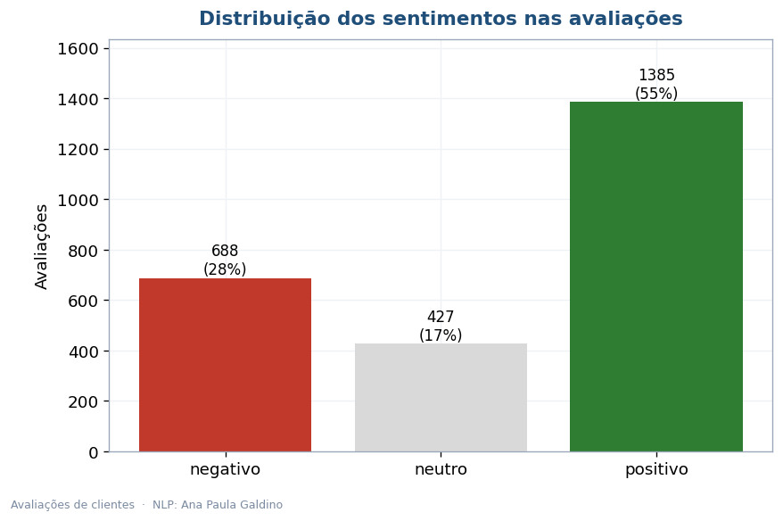
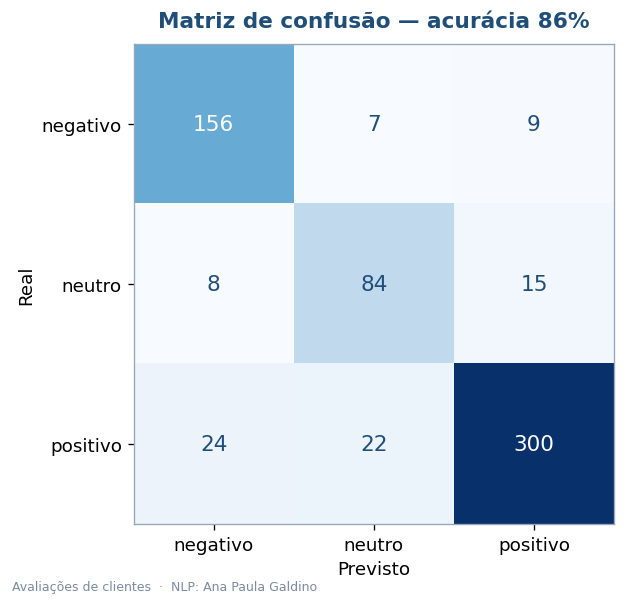
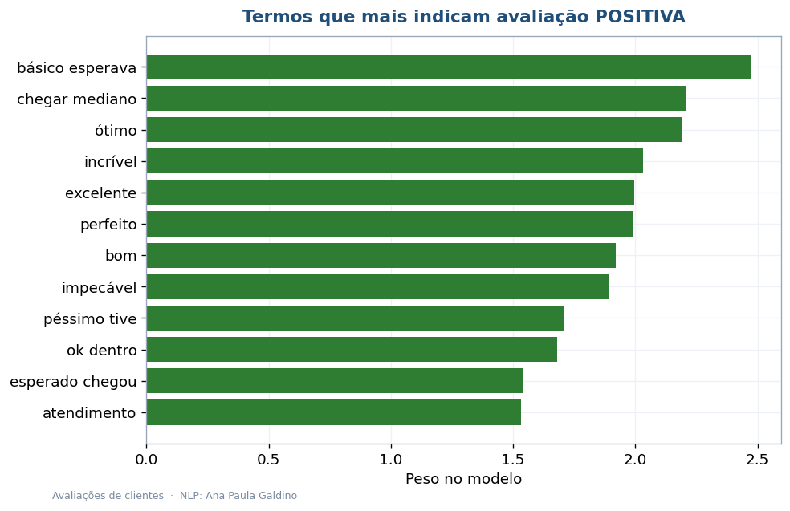
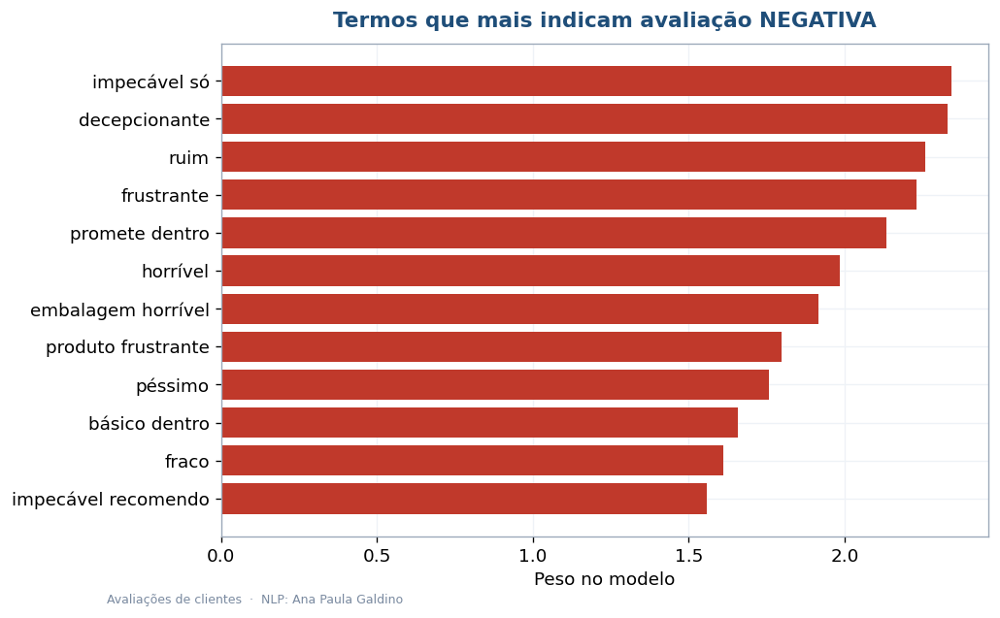
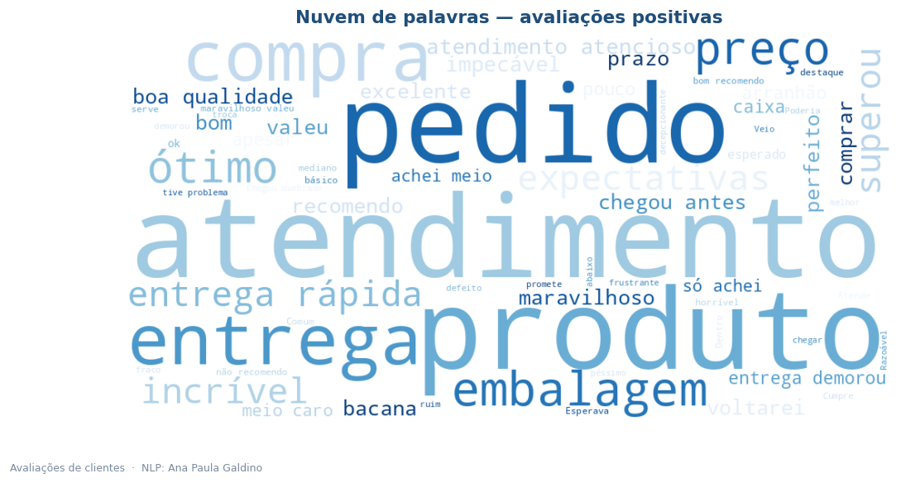
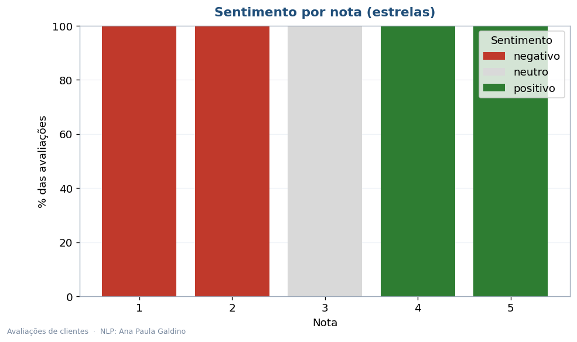

# Análise de Sentimento de Avaliações (NLP)

Quando chegam milhares de avaliações, ninguém lê uma por uma. Este projeto ensina um modelo
a fazer isso: ele lê o texto da avaliação e diz se o cliente ficou **satisfeito, neutro ou
insatisfeito** — e ainda mostra quais palavras o levaram a essa conclusão.

**[Ler o relatório executivo (PDF)](Analise_Executiva_Sentimento.pdf)**

## Como funciona

1. Transformo o texto em números com **TF-IDF** (unigramas e bigramas).
2. Treino uma **Regressão Logística** para classificar o sentimento.
3. Avalio num conjunto de teste e extraio os **termos mais decisivos** de cada classe.

## Resultado

| | |
|---|---|
| Avaliações analisadas | 2.500 |
| Acurácia (teste) | **86%** |
| F1-macro | 84% |
| Avaliações positivas | ~55% |
| Avaliações negativas | ~28% |

Por que não 100%? Porque dados de texto reais têm ambiguidade — avaliações mornas, mistas e
sarcásticas. Um modelo "perfeito demais" seria sinal de problema. 86% é um resultado honesto e
útil, com os erros concentrados na fronteira com a classe neutra.

## As visualizações

| | |
|---|---|
|  |  |
|  |  |
|  |  |

## Tecnologias

Python 3.10+, scikit-learn (TF-IDF, Regressão Logística), wordcloud, pandas, matplotlib e reportlab.

## Organização

```
analise-sentimento-nlp/
├── README.md
├── Analise_Executiva_Sentimento.pdf
├── requirements.txt
├── dados/avaliacoes.csv
├── src/
│   ├── gerar_dados.py            # monta as avaliações
│   ├── analise_sentimento.py     # treina o classificador e gera os 6 gráficos
│   └── gerar_relatorio.py        # monta o PDF
└── imagens/
```

```bash
pip install -r requirements.txt
python src/gerar_dados.py
python src/analise_sentimento.py
python src/gerar_relatorio.py
```

## Sobre os dados

As 2.500 avaliações foram geradas por mim em português, de propósito com casos ambíguos e
ruído de rotulagem (~12%), para refletir a dificuldade real da tarefa. Para usar avaliações
reais, basta um CSV com as colunas `avaliacao` e `sentimento`.

---

Ana Paula Galdino · Data Analytics (POSTECH/FIAP)
[GitHub](https://github.com/AnaPaula-Galdino) · [LinkedIn](https://linkedin.com/in/galdinoana/)
